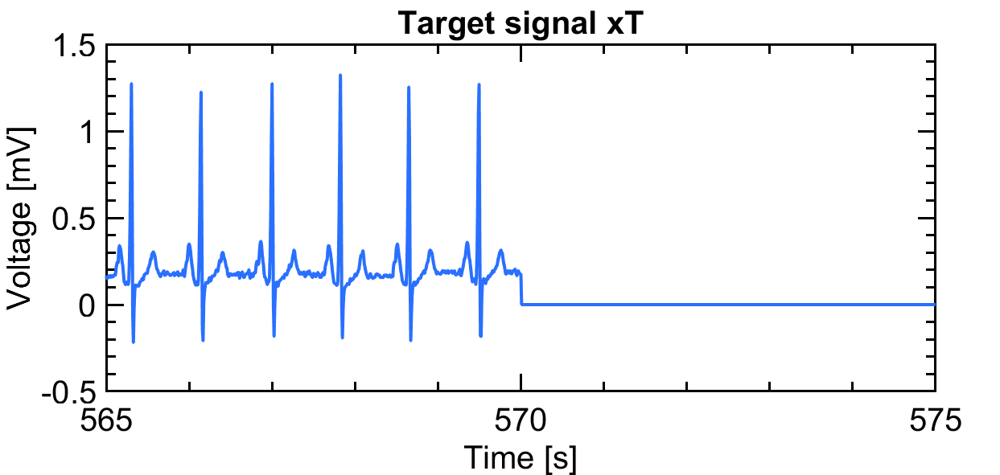

# Reconstruction of ECG signals using RLS and ADAM optimizer.

## Description 

8 patients have measured ECG-signals. The last 30 seconds of a 10 minute long signal is missing for each one. 
To reconstruct the last part, two methods have been used; A recursive least-squares (RLS) algorithm and the ADAM optimizer.
The ADAM optimizer was proven to be computational effective.

<p align="center">



</p>

The project is based on the 2010 challenge published by the online forum [PhysioNet](https://physionet.org/content/challenge-2010/1.0.0/) Every year the challenge focus on a different issue in the field of biomedicine. The 2010 challenge is about reconstructing a missing electrocardiogram (ECG) signal from different patients. In order to estimate the lost part of the signal, two different correlated signals are available. An example of these signals for patient number two is shown in Fig. 1. The goal is to estimate the last 30 seconds of the target signal using the two correlated signals x1 and x2.


- Main code is in ```main.m```
- The filters used were RLS and ADAM and are found in folder ```filters```.
- The folder ```functions``` are custom functions used for reading data, getting reconstruction, plot results, etc.
- Original figures presented in the repport are found in ```Result```.
- Report is found [here](report.pdf).
